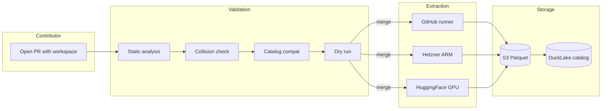
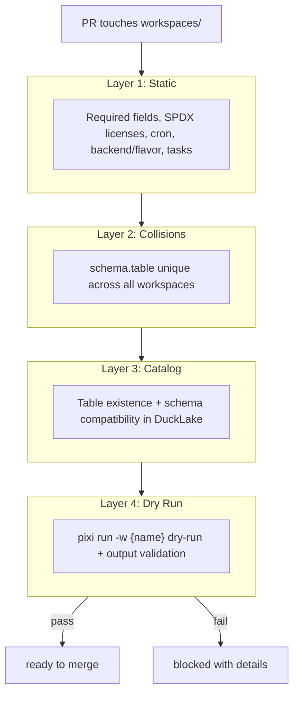
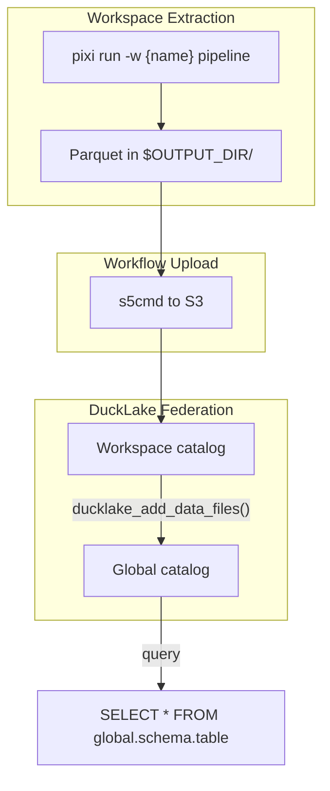

# ai-data-registry

Git-native, PR-driven data platform. Fork, add a data pipeline as a workspace, open a PR. Automated validation, extraction, and catalog federation handle the rest.

## How It Works



Each workspace is an isolated pipeline with its own language, deps, and compute backend. [DuckLake](https://ducklake.select/) federates all outputs into one queryable global catalog via zero-copy file registration.

## Quick Start

**Prerequisites:** [Pixi](https://pixi.sh) (`brew install pixi` or `curl -fsSL https://pixi.sh/install.sh | bash`)

```bash
git clone <your-fork-url>
cd ai-data-registry
pixi install
```

### Create a Workspace

```bash
/new-workspace my-pipeline python    # Claude Code slash command
```

Or manually:

```bash
mkdir -p workspaces/my-pipeline
cd workspaces/my-pipeline
pixi init . --channel conda-forge --platform osx-arm64 --platform linux-64 --platform win-64
cd ../..
pixi workspace register --name my-pipeline --path workspaces/my-pipeline
rm workspaces/my-pipeline/pixi.lock
pixi add -w my-pipeline python
```

Then add your `[tool.registry]` config, write your extract script, and open a PR. See `workspaces/test-minimal/` for a working example.

## Workspace Contract

Every workspace `pixi.toml` needs:

```toml
[tasks]
extract = "python extract.py"                                     # writes to $OUTPUT_DIR/
validate = { cmd = "python validate_local.py", depends-on = ["extract"] }
pipeline = { depends-on = ["extract", "validate"] }               # runner entry point
dry-run = { cmd = "python extract.py", env = { DRY_RUN = "1" } } # PR validation

[tool.registry]
description = "What this pipeline extracts"
schedule = "0 6 * * *"        # cron
timeout = 30                  # minutes
tags = ["topic"]
schema = "my-pipeline"        # S3 prefix + DuckLake schema (must be unique)
table = "data"
mode = "append"               # append | replace | upsert

[tool.registry.runner]
backend = "github"            # github | hetzner | huggingface
flavor = "ubuntu-latest"

[tool.registry.license]
code = "Apache-2.0"           # OSI-approved SPDX
data = "CC-BY-4.0"            # recognized SPDX
data_source = "Source Name"
mixed = false

[tool.registry.checks]
min_rows = 100
max_null_pct = 5
unique_cols = ["id"]
```

**Key rules:** Write Parquet to `$OUTPUT_DIR/`, never to S3 directly. Do not hardcode `OUTPUT_DIR` in task env. No credentials in code (use `$WORKSPACE_SECRET_*`).

## Compute Backends

| Backend | Flavors | Use case |
|---------|---------|----------|
| `github` | `ubuntu-latest` | Lightweight: API calls, CSV/JSON downloads |
| `hetzner` | `cax11` `cax21` `cax31` `cax41` | Medium: spatial processing, large datasets (ephemeral ARM) |
| `huggingface` | `cpu-basic` `cpu-upgrade` `t4-small` `t4-medium` `l4x1` `a10g-small` `a10g-large` `a10g-largex2` `a100-large` | GPU: ML inference, embeddings (Docker) |

Need something else? Open an issue. Infrastructure is maintainer-managed.

## PR Validation



Layers 1-2 and 4 work on fork PRs without secrets. Layer 3 gracefully skips when S3 credentials are unavailable.

After validation, a maintainer can trigger full extraction to a staging prefix:

```
/run-extract              # auto-detects changed workspaces
/run-extract my-pipeline  # specific workspace
```

Staging data is auto-cleaned when the PR closes.

## Data Flow



Workspace code has READ-ONLY S3 access. The workflow handles uploads with write credentials.

## Project Structure

```
ai-data-registry/
├── pixi.toml                  # Shared tools (GDAL, DuckDB, gpio, s5cmd, pnpm)
├── pixi.lock                  # Single lock for all workspaces
├── CONTRIBUTING.md            # Contributor guide
├── MAINTAINING.md             # Maintainer guide
├── .github/
│   ├── registry.config.toml   # Backend + storage config
│   ├── scripts/               # CI scripts (uv + PEP 723)
│   └── workflows/             # Validation, extraction, scheduling
├── workspaces/
│   └── test-minimal/          # Reference implementation
├── research/
│   └── architecture.md        # Full architecture doc
├── docs/
│   ├── secrets-setup.md       # Repository secrets reference
│   └── tool-versions.md       # Shared tool versions + deps guide
└── .claude/                   # AI rules, skills, agents, commands
```

## Fork Setup (Maintainer)

1. **Configure storage** in `.github/registry.config.toml` (defaults work for most setups)
2. **Set repository secrets** per [docs/secrets-setup.md](docs/secrets-setup.md)
3. **Push and open a PR** with a workspace under `workspaces/` to verify

## Shared Tools

All tools run through pixi. Never run directly.

| Tool | Command |
|------|---------|
| GDAL >=3.12 | `pixi run gdal ...` |
| DuckDB >=1.5 | `pixi run duckdb ...` |
| gpio | `pixi run gpio ...` |
| s5cmd | `pixi run s5cmd ...` |
| Python >=3.12 | `pixi run python ...` |
| pnpm | `pixi run pnpm ...` |

Full versions and dependency guide: [docs/tool-versions.md](docs/tool-versions.md)

## Claude Code

This repo includes a full AI-assisted development setup in `.claude/`. Contributors can use [Claude Code](https://claude.ai/code) to scaffold workspaces, debug pipelines, and explore data:

| Command | What it does |
|---------|-------------|
| `/new-workspace <name> <lang>` | Scaffold workspace with full contract |
| `/inspect-file <path>` | Inspect data file (schema, rows, spatial) |
| `/query <SQL>` | Run DuckDB query |
| `/add-dep <pkg> [-w ws]` | Add dependency |
| `/convert <in> <out>` | Convert geospatial formats |

## Docs

| Document | Audience | What it covers |
|----------|----------|---------------|
| [CONTRIBUTING.md](CONTRIBUTING.md) | Contributors | Workspace creation, contract, PR flow |
| [MAINTAINING.md](MAINTAINING.md) | Maintainers | CI/CD, DuckLake, infra, debugging |
| [research/architecture.md](research/architecture.md) | Both | Full platform architecture |
| [docs/secrets-setup.md](docs/secrets-setup.md) | Maintainers | Repository secrets configuration |
| [docs/tool-versions.md](docs/tool-versions.md) | Both | Shared tool versions and deps guide |

## License

CC BY 4.0 - [Walkthru.Earth](https://walkthru.earth) - See [LICENSE](LICENSE)
