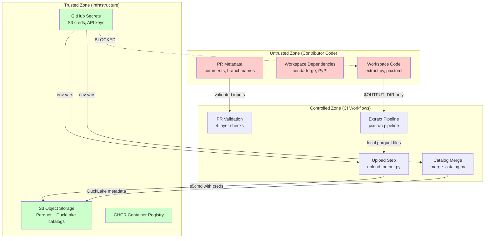
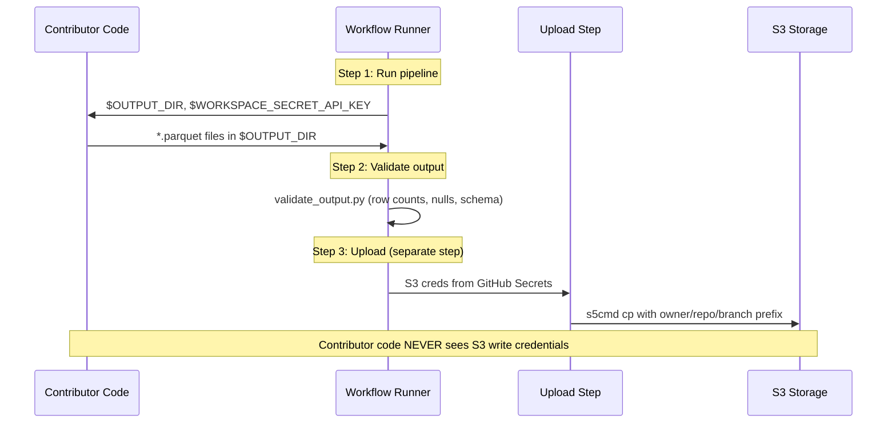
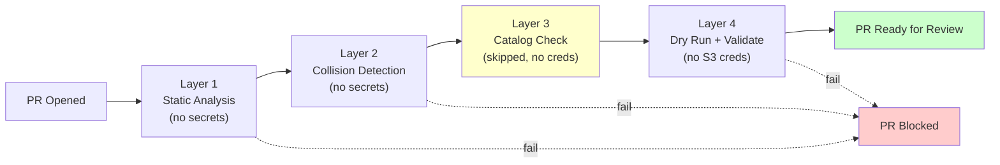
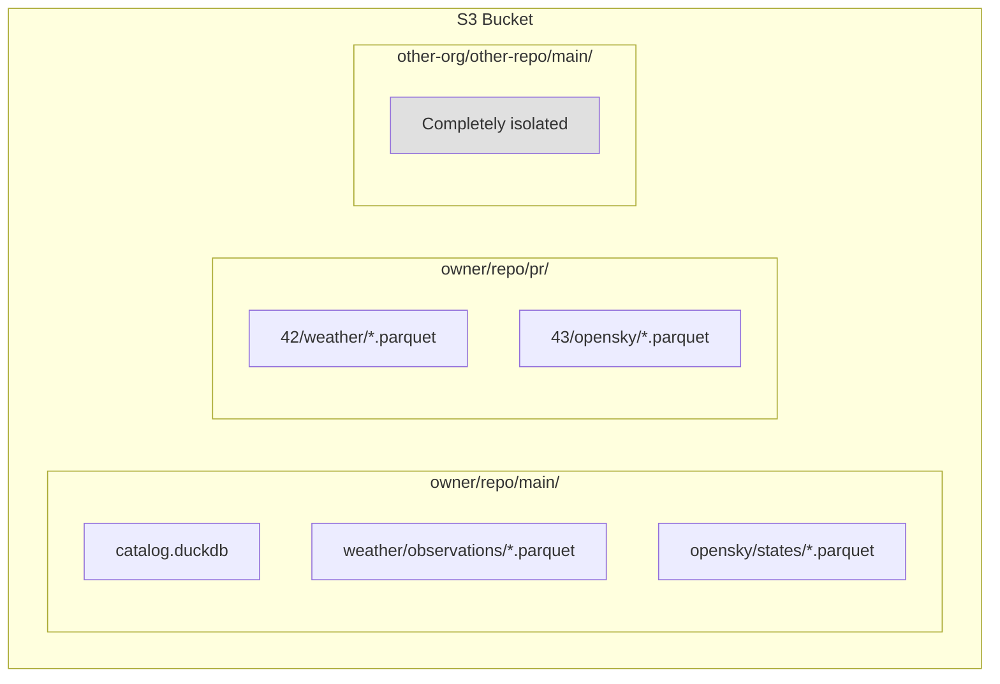
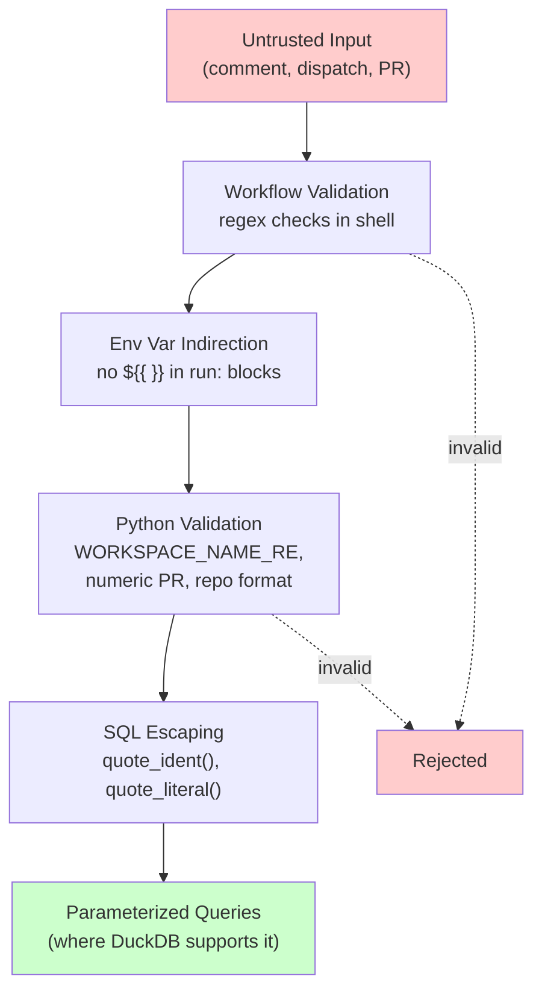

# Security Policy

## Reporting Vulnerabilities

If you discover a security vulnerability in this project, please report it responsibly.

**Email:** [hi@walkthru.earth](mailto:hi@walkthru.earth)
**Subject line:** `[SECURITY-GITHUB-REPO]`

Please include:
- Description of the vulnerability
- Steps to reproduce
- Affected files or workflows
- Potential impact

We will acknowledge receipt within 48 hours and aim to provide a fix or mitigation within 7 days for critical issues.

**Do NOT open a public GitHub issue for security vulnerabilities.** Use the email above for responsible disclosure.

## Security Architecture

### Trust Boundaries

The platform has three trust zones. Untrusted contributor code never touches credentials or S3 directly.

### Credential Flow

Workspace code receives only `$WORKSPACE_SECRET_API_KEY` (for external API access) and `$OUTPUT_DIR` (where to write parquet). S3 write credentials are isolated to the upload step, which runs after workspace code finishes.

### PR Validation Pipeline

PRs from contributors (including forks) go through 4 validation layers. No write credentials are exposed during validation.

### S3 Path Isolation

All S3 paths are prefixed with `{owner}/{repo}/{branch}/` to prevent cross-repo and cross-branch data collision. PR staging uses a separate prefix keyed on PR number.

### Input Validation Chain

All untrusted inputs are validated at multiple points before reaching S3 or DuckDB.

## Isolation Concerns

### What this platform protects against

| Threat | Mitigation |
|--------|-----------|
| **Secret exfiltration via workspace code** | Workspace code never receives S3 write credentials. Only `$WORKSPACE_SECRET_API_KEY` and `$OUTPUT_DIR` are available. Upload happens in a separate workflow step. |
| **GitHub Actions expression injection** | All `${{ }}` expressions use env var indirection. Never interpolated directly into shell scripts. |
| **DuckDB SQL injection** | All f-string SQL uses `quote_ident()` / `quote_literal()`. Value comparisons use parameterized `?` queries where supported. |
| **S3 path traversal** | `build_repo_prefix()` validates format. `build_branch_prefix()` rejects `..`. PR numbers validated as numeric. Schema/table names validated against `^[a-z][a-z0-9_-]*$`. |
| **Cache poisoning** | Pixi cache writes restricted to main branch pushes. Docker build caches scoped by git ref. |
| **Cross-repo data collision** | All S3 paths prefixed with `{owner}/{repo}/{branch}/`. Different repos sharing a bucket cannot overwrite each other's data. |
| **PR staging escape** | PR staging uses `pr/{number}/` prefix (no branch). Cleanup deletes by PR number deterministically. |

### Known trade-offs

| Trade-off | Reason | Mitigation |
|-----------|--------|-----------|
| **HuggingFace backend receives S3 write creds** | HF containers run on external infrastructure without workflow-level upload steps. There is no way to separate extract from upload. | Scope credentials per workspace when provider supports per-prefix IAM. Audit container images. |
| **Layer 3 catalog check skipped on PRs** | Removing S3 write credentials from PR validation means the catalog compatibility check cannot download the global catalog. | Layers 1, 2, and 4 still run. Full end-to-end testing available via `/run-extract`. Catalog conflicts are rare in practice. |
| **Shared bucket, path-based isolation** | Multiple repos sharing a bucket rely on path prefixes, not IAM policies, for isolation. | Repos sharing a bucket are assumed mutually trusted. Use separate buckets for separate trust domains. |
| **PyPI dependencies not hash-pinned** | Conda-forge packages are preferred and reviewed. PyPI fallbacks use version bounds but no hash verification. | Review `[pypi-dependencies]` changes in PRs. Pin exact versions for security-critical packages. |

### What this platform does NOT protect against

- **Malicious code in workspace extract scripts that exfiltrates `$WORKSPACE_SECRET_API_KEY`**: Workspace code has network access and can send the API key to an external server. Mitigation: code review, rotate keys regularly, use short-lived tokens where possible.
- **Compromised conda-forge or PyPI packages**: A supply chain attack on a dependency could execute arbitrary code during `pixi install`. Mitigation: prefer conda-forge (source-reviewed), pin versions, review dependency changes.
- **Maintainer account compromise**: A compromised maintainer could modify workflows, access secrets, and exfiltrate data. Mitigation: require 2FA, use branch protection with required reviews, rotate secrets.

## Security Checklist for Maintainers

When reviewing PRs that modify CI infrastructure:

- [ ] No `${{ }}` expressions directly in `run:` blocks (must use `env:` indirection)
- [ ] No new secrets exposed to workspace code steps
- [ ] Workspace names, PR numbers, and paths validated before use
- [ ] DuckDB SQL uses `quote_ident()` / `quote_literal()` or parameterized queries
- [ ] `setup-pixi` has `cache-write` restricted to main
- [ ] Docker caches scoped by ref
- [ ] No `shell=True` in `subprocess.run()` calls
- [ ] New dependencies reviewed (prefer conda-forge over PyPI)
