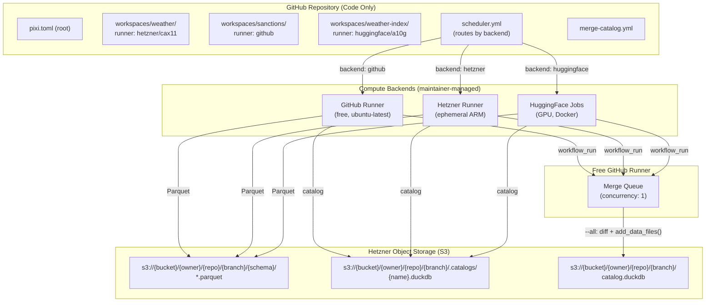
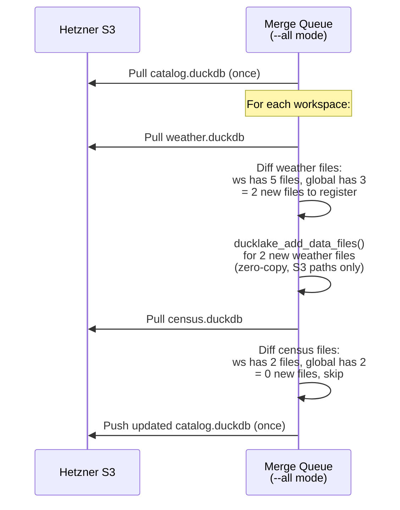
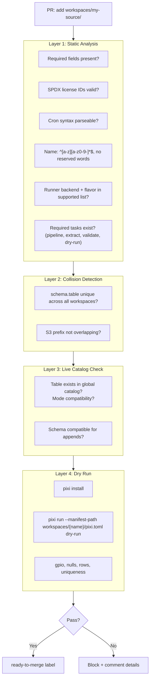
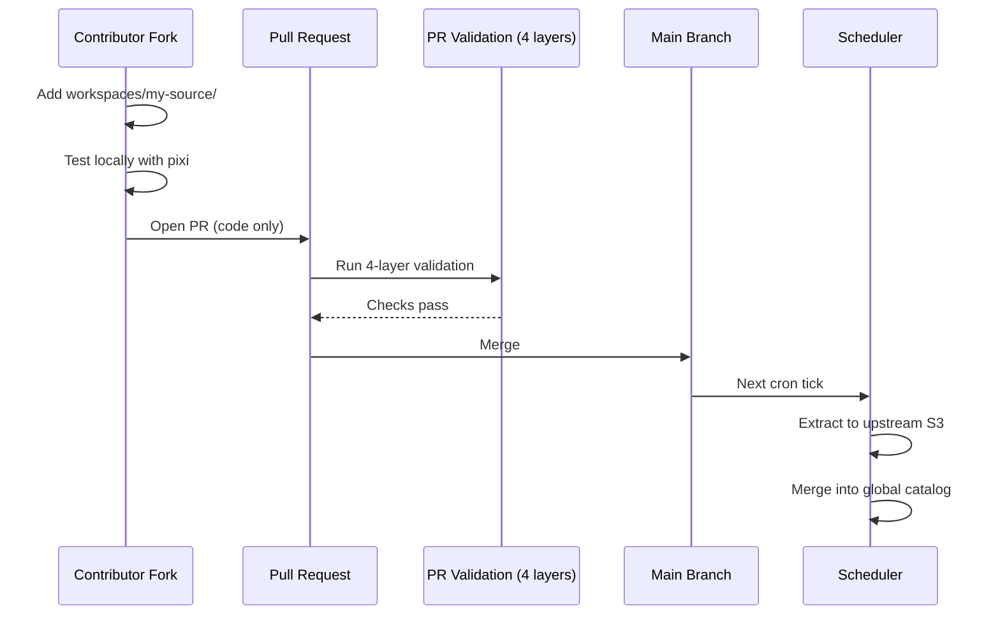

# Data Registry Platform Architecture

> **Note (2026-04-02):** Per-workspace catalogs have been removed. The platform now uses a single global catalog. The merge script scans S3 directly and registers files in the global catalog. This eliminates the shared-file ownership problem and enables safe compaction. Some sections below still reference the old two-catalog design as historical context.

A git-native, PR-driven data platform. Each workspace is an isolated data pipeline with its own language, dependencies, and compute backend. Contributors add workspaces via PRs. Maintainers manage the supported infrastructure. DuckLake federates all workspace outputs into one queryable global catalog via direct S3 file registration.

## Design Principles

1. **Git is the source of truth** for pipeline definitions, schedules, and workspace config
2. **Pixi is the runtime** for reproducible, cross-platform, multi-language environments
3. **One global DuckLake catalog** on S3 (DuckDB backend, not SQLite, no PostgreSQL) is the single source of truth
4. **The merge script scans S3** for Parquet files and registers them directly in the global catalog via `ducklake_add_data_files()`
5. **All catalogs live on S3**, pulled at runtime, never stored in git
6. **Free GitHub runners orchestrate**, Hetzner runners do the heavy lifting
7. **PR-based contribution** model for adding/modifying data sources (like conda-forge recipes)

---

## Architecture



---

## How It Works

### 1. Workspace Extraction (parallel, backend-dependent)

Each workspace runner (GitHub, Hetzner, or HF Jobs, depending on `[tool.registry.runner].backend`):
1. Pulls its workspace catalog from S3 (`s3://{bucket}/{owner}/{repo}/{branch}/.catalogs/{name}.duckdb`)
2. Attaches it as a DuckLake with `DATA_PATH 's3://{bucket}/{owner}/{repo}/{branch}/'`, `META_JOURNAL_MODE 'WAL'`, `META_BUSY_TIMEOUT 500`
3. Runs `pixi run --manifest-path workspaces/{name}/pixi.toml pipeline` which chains setup → extract → validate (stops on failure)
4. Uploads the updated workspace catalog back to S3

The workspace catalog is the workspace's ground truth. It has its own snapshots, time travel, and schema evolution.

### 2. Global Catalog Merge (Free GitHub Runner, serial)

Merge is triggered by `workflow_run` (fires when any extract workflow completes successfully) and a 10-minute cron backstop. Each merge run uses `--all` mode: discovers all workspaces, groups by storage, and merges everything pending in a single run.

The `concurrency: catalog-merge` group serializes runs (1 running + 1 pending). Since each run merges ALL pending workspaces, dropped pending runs do not lose data.

**Per storage target, the merge downloads the global catalog once, then for each workspace:**

**Phase 1 - Sync workspace catalog:**
1. Downloads the workspace catalog from S3 (or creates a new one)
2. For each table in `[tool.registry].tables`, scans S3 for Parquet files under `s3://bucket/{owner}/{repo}/{branch}/{schema}/{table}/*.parquet`
3. Registers any files not yet tracked in the workspace catalog
4. Uploads workspace catalog if changed

**Phase 2 - Merge to global:**
1. Diffs `ducklake_list_files()` between workspace and global
2. Registers only NEW files in the global catalog via `ducklake_add_data_files()` (zero-copy)

**After all workspaces are processed, uploads the global catalog once.**



### Why This Works

- **No concurrent writes**: Only the merge queue writes to the global catalog, with `concurrency: 1`
- **No data loss**: `--all` mode merges every pending workspace in each run. The 1-pending concurrency limit cannot drop data because the surviving run picks up all pending work
- **Zero-copy**: Global catalog stores pointers to workspace Parquet files. No data duplication.
- **Incremental**: File list diff ensures only new files are registered. No duplicates.
- **Efficient**: Global catalog downloaded/uploaded once per storage, not once per workspace
- **Crash-safe**: If a workspace extraction fails, its catalog is unchanged and nothing enters global
- **No catalog in git**: All catalogs live on S3. Pulled at runtime, pushed after mutation.
- **No PostgreSQL**: DuckDB backend is fine because only one process writes to each catalog at a time

### Validated Behavior (DuckDB 1.5.1 + DuckLake + DuckDB backend)

| Behavior | Tested Result |
|----------|--------------|
| `ducklake_add_data_files()` zero-copy | Files stay in workspace S3 prefix. Global catalog stores path pointers only. |
| Incremental registration | New files can be added without re-registering old ones. |
| Duplicate risk | Same file registered twice = duplicate rows. Must diff file lists before registering. |
| Time travel on global | Each `add_data_files` call creates a new snapshot. `AT (VERSION => N)` works. |
| `COPY FROM DATABASE` between DuckLakes | Works for initial load but fails on 2nd run (`Table already exists`). Not incremental. |
| Multiple DuckLake catalogs attached | Works. Can attach N catalogs simultaneously, mix READ_ONLY and READ_WRITE. |

---

## Deduplication: The File List Diff

Since `ducklake_add_data_files` has no built-in duplicate detection, the merge queue must compute the diff:

```python
def get_new_files(ws_catalog, global_catalog, schema, table):
    """Files in workspace catalog not yet in global catalog."""
    ws_files = duckdb.sql(f"""
        SELECT data_file
        FROM ducklake_list_files({quote_literal(ws_catalog)}, {quote_literal(table)}, schema => {quote_literal(schema)})
    """).fetchall()

    global_files = duckdb.sql(f"""
        SELECT data_file
        FROM ducklake_list_files({quote_literal(global_catalog)}, {quote_literal(table)}, schema => {quote_literal(schema)})
    """).fetchall()

    global_set = {f[0] for f in global_files}
    return [f[0] for f in ws_files if f[0] not in global_set]
```

---

## Compaction Safety

`ducklake_add_data_files` transfers file ownership to the target catalog. If the global catalog runs compaction (`CHECKPOINT`, `merge_adjacent_files`), it could DELETE workspace Parquet files and replace them with compacted copies in the global DATA_PATH.

**Rule: exclude the global catalog from bulk maintenance.**

```sql
-- Exclude all global catalog tables from bulk maintenance calls.
-- Note: auto_compact does NOT trigger automatic compaction. DuckLake compaction is always explicit.
-- This flag controls whether tables are INCLUDED when maintenance functions (CHECKPOINT,
-- ducklake_merge_adjacent_files, etc.) are called WITHOUT specifying a table name.
CALL global.set_option('auto_compact', false);
```

Run compaction only on individual workspace catalogs (which own their data paths). The global catalog is a zero-copy index, not a data owner.

---

## S3 Layout

All paths are prefixed with `{owner}/{repo}/{branch}/` for repo and branch isolation. The prefix is derived from GitHub Actions env vars (`GITHUB_REPOSITORY`, `GITHUB_REF_NAME`). In local dev, the prefix is absent (flat layout).

```
s3://registry/
    walkthru-earth/                    # GitHub repo owner
        ai-data-registry/             # GitHub repo name
            main/                     # Git branch name
                .catalogs/            # All DuckLake catalogs (DuckDB backend)
                    weather.duckdb    # Workspace catalog (workspace-owned)
                    opensky-flights.duckdb
                catalog.duckdb        # Global catalog (merge-queue-owned)

                weather/              # Workspace data prefix (= schema name)
                    observations/     # Table subdirectory
                        20260401T060000Z.parquet
                        20260402T060000Z.parquet
                opensky-flights/      # Multi-table workspace
                    states/
                        20260401T000000Z.parquet
                    flights/
                        20260401T000000Z.parquet

            pr/                       # PR staging (no branch, keyed on PR number)
                42/
                    weather/
                        observations/
                            20260401T060000Z.parquet
                42.duckdb             # PR-scoped workspace catalog (optional)
```

**Rule: `schema` in pixi.toml = S3 prefix = workspace write boundary.** Each workspace can only write to its own prefix. The extract workflow timestamps each file to prevent overwrites and enable historical accumulation.

**Multi-storage:** Workspaces can declare multiple named storage targets in `[tool.registry].storage`. Data is replicated to all declared storages. Each storage has independent catalogs. See `.github/registry.config.toml` for storage definitions.

---

## Workspace Manifest (`pixi.toml`)

Each workspace carries pipeline metadata in `[tool.registry]` (pixi ignores unknown `[tool.*]` tables). The full contract is defined in `CONTRIBUTING.md` and enforced by `.claude/rules/workspace-contract.md`.

Key design choices:
- `[tool.registry]` stores schedule, schema, table(s), mode, storage, backend, license, and quality checks
- `[tool.registry.runner]` declares compute needs (backend + flavor). PR validation enforces supported list
- `[tool.registry.license]` requires SPDX identifiers for both code and data
- `[tool.registry.checks]` supports per-table overrides via `[tool.registry.checks.<table_name>]`
- Tasks use pixi `depends-on` chains. `pipeline` is the entry point, `dry-run` is for PR validation
- Any language works. The compute backend is separate from the pipeline language

### Task Lifecycle

The runner calls **one command**: `pixi run --manifest-path workspaces/{name}/pixi.toml pipeline`. Pixi's `depends-on` chains handle ordering and halt on first failure (non-zero exit). No custom hooks needed.

```
setup ──→ extract ──→ validate
                         │
                    (chain stops on any non-zero exit)
```

| Phase | Task | Required? | What it does |
|-------|------|-----------|------|
| **Setup** | `setup` | Optional | Download source data, auth checks, prep temp dirs |
| **Extract** | `extract` | Required | Core pipeline. Writes Parquet to `$OUTPUT_DIR/` |
| **Validate** | `validate` | Required | gpio checks, row counts, null pct, schema match |
| **Entry point** | `pipeline` | Required | Alias that chains setup → extract → validate |
| **PR mode** | `dry-run` | Required | Runs extract with `DRY_RUN=1` for sample output |

**Key pixi features used:**
- `depends-on`: chains tasks, stops on failure
- `env`: passes `DRY_RUN` to tasks. Do NOT hardcode `OUTPUT_DIR` in task env (CI overrides it)
- `args`: optional, for parameterized tasks (e.g., `pixi run extract --date 2026-03-30`)
- `inputs/outputs`: optional, enables caching (skip extract if source unchanged)

```toml
# Example: task with arguments (MiniJinja templating)
[tasks.extract]
cmd = "python extract.py --date {{ date }}"
args = [{ arg = "date", default = "today" }]
depends-on = ["setup"]

# Example: task with caching (skip if input unchanged)
[tasks.extract]
cmd = "python extract.py"
depends-on = ["setup"]
inputs = ["extract.py", "config/*.yaml"]
outputs = ["output/*.parquet"]
```

---

## S3 Write Isolation

Workspace code gets READ-ONLY S3 credentials. It writes Parquet to local `$OUTPUT_DIR`. The workflow validates output, then uploads to the correct S3 prefix via `s5cmd` (parallel, 256 workers by default). The workspace code never gets S3 write access.

```mermaid
sequenceDiagram
    participant WF as Extract Workflow
    participant HR as Hetzner Runner
    participant S3 as Hetzner S3

    WF->>HR: Start with READ-ONLY S3 creds
    HR->>HR: pixi run --manifest-path workspaces/weather/pixi.toml extract<br/>(writes to local $OUTPUT_DIR)
    HR->>HR: Validate output<br/>(prefix, gpio, row counts)
    Note over HR: Workflow step (not workspace code)<br/>has S3 WRITE creds
    HR->>S3: upload_output.py<br/>s3://{bucket}/{owner}/{repo}/{branch}/weather/&lt;table&gt;/&lt;ts&gt;.parquet
    HR->>S3: Upload workspace catalog
```

---

## PR Pre-Merge Checks (4 Layers)



Layer 3 pulls the global catalog from S3 at runtime to check for conflicts. No catalog in git means the CI always works with the live state.

### Collision Rule

**One workspace owns one schema.table.** Enforced by scanning all workspace `pixi.toml` files on `main` plus the PR's changes. Two workspaces declaring the same `schema.table` is a hard block.

### License Validation

License validation rules are in `CONTRIBUTING.md`.

### PR Staging Extraction

After the 4-layer validation passes, a maintainer can trigger a **full extraction** against the PR branch to verify the real pipeline end-to-end before merging. This uploads data to a staging S3 prefix, never to production.

**Trigger:** Maintainer comments `/run-extract` on the PR (or `/run-extract weather` for a specific workspace). Only users with write/maintain/admin access can trigger.

**Flow:**
1. `pr-extract.yml` checks permissions, parses workspace names from the comment (or auto-detects from PR diff)
2. Checks out the PR branch, runs `pixi run --manifest-path workspaces/{name}/pixi.toml pipeline` (full extraction, not dry-run)
3. Uploads Parquet output to `s3://bucket/{owner}/{repo}/pr/{pr_number}/{workspace}/` (staging prefix)
4. Runs output validation (row counts, nulls, geometry)
5. Posts a PR comment with DuckDB query examples to inspect the staged data

**Cleanup:** `pr-cleanup.yml` triggers on PR close (merge or abandon), deletes all data under `s3://bucket/{owner}/{repo}/pr/{pr_number}/`. Fully automatic.

**Why PR number, not branch name:** Branch names can contain `/` and special characters that break S3 paths. PR numbers are unique, short, and stable.

---

## Scheduling

The scheduler runs on a free GitHub runner via cron. It reads `[tool.registry].schedule` from every workspace's `pixi.toml`, compares against a state file (stored as workflow artifact, not in git), and dispatches Hetzner runners for due workspaces.

```json
{
  "weather": { "last_run": "2026-03-30T06:00:00Z", "status": "success", "snapshot": 42 },
  "census":  { "last_run": "2026-03-01T00:00:00Z", "status": "success", "snapshot": 38 },
  "osm":     { "last_run": "2026-03-29T00:00:00Z", "status": "failed",  "snapshot": null }
}
```

| Pattern | Cron | Example |
|---------|------|---------|
| Every 5 min | `*/5 * * * *` | Real-time feeds |
| Hourly | `0 * * * *` | Sensor data |
| Daily | `0 6 * * *` | Most datasets |
| Weekly | `0 0 * * 1` | Aggregations |
| Monthly | `0 0 1 * *` | Census, reports |

### Merge Trigger Model

Extract workflows do not dispatch merges directly. Instead, `merge-catalog.yml` uses dual triggers:

1. **`workflow_run`**: fires when any extract workflow (`Extract (GitHub Runner)`, `Extract (Hetzner Runner)`, `Extract (HuggingFace Jobs)`) completes successfully. Runs `--all` to merge every workspace with pending data.
2. **Cron backstop** (every 10 min): catches any merges dropped by the concurrency group's 1-pending limit. Idempotent, exits fast when nothing is pending.
3. **`workflow_dispatch`**: manual trigger. Pass `workspace` for a single workspace, or leave empty for `--all`.

The `--all` mode groups workspaces by storage target, downloads the global catalog once per storage, merges all pending workspaces sequentially, then uploads once. Data is available within minutes of extraction completing.

All merge runs share `concurrency: catalog-merge` so they never overlap. Since each run merges ALL pending workspaces, dropped pending runs do not lose data.

---

## Runner Backends

Not all workspaces need the same compute. A lightweight CSV download runs fine on a free GitHub runner. A GPU ML inference pipeline needs Hugging Face Jobs. A one-shot global DEM conversion needs a 360-vCPU bare-metal server.

### Maintainer vs Contributor Responsibility

**Infrastructure is maintainer-managed.** Contributors pick from a menu of supported backends. They never bring their own infrastructure, workflows, Terraform configs, or cloud credentials via PRs.

| Responsibility | Maintainer | Contributor |
|----------------|-----------|-------------|
| Runner backend workflows (`extract-*.yml`) | Creates and maintains | Uses as-is |
| Cloud credentials and secrets | Provisions and rotates | Never touches |
| Supported backend list | Decides which backends are available | Picks from the list |
| `[tool.registry.runner]` | Approves in PR review | Declares in workspace `pixi.toml` |
| Flavor/machine sizing | Sets allowed flavors per backend | Requests within allowed range |
| Docker images (HF backend) | Owns base images and build workflow | Extends via Dockerfile in workspace |
| Custom/heavy infra | Provisions on request | Opens an issue to request |

**Why:** A contributor PR should never be able to provision servers, access cloud APIs, or run Terraform with maintainer credentials. The workflow files, secrets, and runner configs are all in the maintainer's domain. The contributor only declares intent ("I need a GPU"), the maintainer's infrastructure fulfills it.

### Runner Configuration (`[tool.registry.runner]`)

Contributors declare compute needs. PR validation checks that the backend and flavor are in the supported list.

```toml
[tool.registry.runner]
backend = "hetzner"           # Must be in supported list (PR validation enforces this)
flavor = "cax11"              # Must be an allowed flavor for this backend
# image = "ghcr.io/..."       # Docker image (required for huggingface)
# gpu = true                  # hint: workspace needs GPU
```

### Supported Backends (maintainer-managed)

See `CONTRIBUTING.md` for the full backend/flavor table.

New backends (e.g., Verda bare-metal, AWS Batch) are added by the maintainer when needed, not by contributors. To request a new backend or a heavy one-shot job, open an issue.

### How the Scheduler Routes

The scheduler reads `[tool.registry.runner]` and dispatches to the corresponding maintainer-managed workflow. Unknown backends are rejected.

```python
# .github/scripts/find-due.py (simplified)
SUPPORTED_BACKENDS = {
    "github":      {"workflow": "extract-github.yml",      "flavors": ["ubuntu-latest"]},
    "hetzner":     {"workflow": "extract-hetzner.yml",     "flavors": ["cax11", "cax21", "cax31", "cax41"]},
    "huggingface": {"workflow": "extract-huggingface.yml", "flavors": ["cpu-basic", "cpu-upgrade", "t4-small", "t4-medium", "l4x1", "a10g-small", "a10g-large", "a10g-largex2", "a100-large"]},
}

def dispatch_workspace(ws_name, registry_config):
    runner = registry_config.get("runner", {})
    backend = runner.get("backend", "github")
    flavor = runner.get("flavor")

    if backend not in SUPPORTED_BACKENDS:
        raise ValueError(f"Workspace {ws_name}: unsupported backend '{backend}'. "
                         f"Supported: {list(SUPPORTED_BACKENDS.keys())}")

    spec = SUPPORTED_BACKENDS[backend]
    if flavor and flavor not in spec["flavors"]:
        raise ValueError(f"Workspace {ws_name}: flavor '{flavor}' not allowed for {backend}. "
                         f"Allowed: {spec['flavors']}")

    dispatch_workflow(spec["workflow"],
                      workspace=ws_name,
                      flavor=flavor or spec["flavors"][0],
                      **({k: runner[k] for k in ("image",) if k in runner}))
```

### Backend: GitHub Free (`backend = "github"`)

Simplest. No infrastructure to manage. Good for workspaces that download small files or call APIs.

```toml
# workspaces/sanctions/pixi.toml
[tool.registry.runner]
backend = "github"
flavor = "ubuntu-latest"
```

```yaml
# .github/workflows/extract-github.yml
name: Extract (GitHub Runner)
on:
  workflow_call:
    inputs:
      workspace: { required: true, type: string }

concurrency:
  group: extract-${{ inputs.workspace }}
  cancel-in-progress: false

jobs:
  extract:
    runs-on: ubuntu-latest
    timeout-minutes: 30
    steps:
      - uses: actions/checkout@v4

      - uses: prefix-dev/setup-pixi@v0.9
        with:
          cache: true

      - name: Run pipeline
        env:
          OUTPUT_DIR: ${{ runner.temp }}/output
          WORKSPACE_SECRET_API_KEY: ${{ secrets[format('WS_{0}_API_KEY', inputs.workspace)] }}
          WORKSPACE: ${{ inputs.workspace }}
        run: pixi run --manifest-path "workspaces/$WORKSPACE/pixi.toml" pipeline

      - name: Upload output to all storages
        env:
          S3_ENDPOINT_URL: ${{ secrets.S3_ENDPOINT_URL }}
          S3_BUCKET: ${{ secrets.S3_BUCKET }}
          S3_WRITE_KEY_ID: ${{ secrets.S3_WRITE_KEY_ID }}
          S3_WRITE_SECRET: ${{ secrets.S3_WRITE_SECRET }}
          WORKSPACE: ${{ inputs.workspace }}
          RUNNER_TEMP: ${{ runner.temp }}
        run: |
          # upload_output.py handles multi-storage replication and
          # owner/repo/branch prefix from GITHUB_REPOSITORY/GITHUB_REF_NAME
          uv run .github/scripts/upload_output.py \
            --workspace "$WORKSPACE" \
            --output-dir "${RUNNER_TEMP}/output" \
            --timestamp "$(date -u +%Y%m%dT%H%M%SZ)"
```

### Backend: Hetzner Cloud (`backend = "hetzner"`)

Three-job pattern via [Cyclenerd/hcloud-github-runner](https://github.com/Cyclenerd/hcloud-github-runner): **create → work → delete (always)**. Ephemeral server, destroyed after each run.

```toml
# workspaces/weather/pixi.toml
[tool.registry.runner]
backend = "hetzner"
flavor = "cax11"              # ARM 2 vCPU, 4GB, 40GB
```

```yaml
# .github/workflows/extract-hetzner.yml
name: Extract (Hetzner Runner)
on:
  workflow_call:
    inputs:
      workspace: { required: true, type: string }
      server_type: { required: false, type: string, default: "cax11" }

concurrency:
  group: extract-${{ inputs.workspace }}
  cancel-in-progress: false

jobs:
  create-runner:
    runs-on: ubuntu-latest
    outputs:
      label: ${{ steps.hcloud.outputs.label }}
      server_id: ${{ steps.hcloud.outputs.server_id }}
    steps:
      - id: hcloud
        uses: Cyclenerd/hcloud-github-runner@v1
        with:
          mode: create
          github_token: ${{ secrets.RUNNER_PAT }}
          hcloud_token: ${{ secrets.HCLOUD_TOKEN }}
          server_type: ${{ inputs.server_type }}
          location: fsn1

  extract:
    needs: create-runner
    runs-on: ${{ needs.create-runner.outputs.label }}
    timeout-minutes: 60
    steps:
      - uses: actions/checkout@v4

      - uses: prefix-dev/setup-pixi@v0.9
        with:
          cache: true
          post-cleanup: true    # Security: delete .pixi after job on self-hosted runner

      - name: Run pipeline
        env:
          OUTPUT_DIR: ${{ runner.temp }}/output
          WORKSPACE_SECRET_API_KEY: ${{ secrets[format('WS_{0}_API_KEY', inputs.workspace)] }}
          WORKSPACE: ${{ inputs.workspace }}
        run: pixi run --manifest-path "workspaces/$WORKSPACE/pixi.toml" pipeline

      - name: Upload output to all storages
        env:
          S3_ENDPOINT_URL: ${{ secrets.S3_ENDPOINT_URL }}
          S3_BUCKET: ${{ secrets.S3_BUCKET }}
          S3_WRITE_KEY_ID: ${{ secrets.S3_WRITE_KEY_ID }}
          S3_WRITE_SECRET: ${{ secrets.S3_WRITE_SECRET }}
          WORKSPACE: ${{ inputs.workspace }}
          RUNNER_TEMP: ${{ runner.temp }}
        run: |
          # upload_output.py handles multi-storage replication and
          # owner/repo/branch prefix from GITHUB_REPOSITORY/GITHUB_REF_NAME
          uv run .github/scripts/upload_output.py \
            --workspace "$WORKSPACE" \
            --output-dir "${RUNNER_TEMP}/output" \
            --timestamp "$(date -u +%Y%m%dT%H%M%SZ)"

  delete-runner:
    needs: [create-runner, extract]
    runs-on: ubuntu-latest
    if: ${{ always() }}
    steps:
      - uses: Cyclenerd/hcloud-github-runner@v1
        with:
          mode: delete
          github_token: ${{ secrets.RUNNER_PAT }}
          hcloud_token: ${{ secrets.HCLOUD_TOKEN }}
          server_id: ${{ needs.create-runner.outputs.server_id }}
```

| Model | Cores | Arch | RAM | Disk | Use case |
|-------|-------|------|-----|------|----------|
| `cax11` | 2 | ARM | 4 GB | 40 GB | Most workspaces (default) |
| `cax21` | 4 | ARM | 8 GB | 80 GB | Medium datasets |
| `cax31` | 8 | ARM | 16 GB | 160 GB | Large spatial datasets |
| `cax41` | 16 | ARM | 32 GB | 320 GB | Heavy processing |

**Security notes for Hetzner backend:**
- `RUNNER_PAT` must be a fine-grained PAT with minimum scope (`actions:write` for runner management only). Prefer a GitHub App token for automatic rotation.
- Add a Hetzner cleanup cron job that deletes servers tagged `github-runner-*` older than 2 hours, as a safety net for partial `create-runner` failures where the server was created but `server_id` was not captured.
- `post-cleanup: true` in setup-pixi ensures `.pixi`, pixi binary, and rattler cache are deleted after the job, preventing credential leaks on self-hosted runners.

### Workflow Security Patterns

All workflows follow the security patterns defined in `MAINTAINING.md` (Security section) and enforced by `.claude/rules/ci-security.md`. For the full threat model and trust boundaries, see `SECURITY.md`.

### Backend: Hugging Face Jobs (`backend = "huggingface"`)

For GPU workloads (ML inference, weather models, embeddings). The workspace runs inside a Docker container on HF infrastructure. No pixi on the runner. The container is the environment.

Pattern from walkthru-weather-index: GitHub Actions submits to HF Jobs API via `huggingface_hub.run_job()`, which runs the Docker image on HF GPU hardware.

```toml
# workspaces/weather-index/pixi.toml
[tool.registry.runner]
backend = "huggingface"
flavor = "a10g-large"         # A10G 24GB, 12 vCPU, 46GB RAM
image = "ghcr.io/walkthru-earth/weather-index:latest"
gpu = true
```

```yaml
# .github/workflows/extract-huggingface.yml
name: Extract (HuggingFace Jobs)
on:
  workflow_call:
    inputs:
      workspace: { required: true, type: string }
      flavor: { required: false, type: string, default: "a10g-large" }
      image: { required: true, type: string }

concurrency:
  group: extract-${{ inputs.workspace }}
  cancel-in-progress: false

jobs:
  submit:
    runs-on: ubuntu-latest
    timeout-minutes: 10
    steps:
      - uses: actions/checkout@v4

      - uses: prefix-dev/setup-pixi@v0.9
        with:
          cache: true

      # Submit job to HF and wait for completion
      # The workspace's scripts/submit_hf_job.py handles HF API interaction
      - name: Submit HF Job
        env:
          HF_TOKEN: ${{ secrets.HF_TOKEN }}
          HF_JOB_NAMESPACE: ${{ github.repository_owner }}
          HF_JOB_IMAGE: ${{ inputs.image }}
          HF_JOB_FLAVOR: ${{ inputs.flavor }}
          WORKSPACE_SECRET_API_KEY: ${{ secrets[format('WS_{0}_API_KEY', inputs.workspace)] }}
          S3_BUCKET: ${{ secrets.S3_BUCKET }}
          S3_PREFIX: ${{ inputs.workspace }}
          AWS_ACCESS_KEY_ID: ${{ secrets.AWS_ACCESS_KEY_ID }}
          AWS_SECRET_ACCESS_KEY: ${{ secrets.AWS_SECRET_ACCESS_KEY }}
          AWS_DEFAULT_REGION: ${{ secrets.AWS_DEFAULT_REGION }}
          WORKSPACE: ${{ inputs.workspace }}
        run: pixi run --manifest-path "workspaces/$WORKSPACE/pixi.toml" pipeline
```

**Security note:** The HF backend passes S3 write credentials directly to the container, breaking the write-isolation pattern used by GitHub/Hetzner backends. This is an accepted trade-off because HF containers run on external infrastructure without workflow-level upload steps. Mitigate by scoping S3 credentials per workspace if Hetzner adds per-prefix IAM support, or use a proxy that validates write paths.

**Key differences from pixi-native backends:**
- The `extract` task calls `submit_hf_job.py` (or similar), not the actual data processing code
- Data processing happens inside the Docker container on HF hardware
- The container writes directly to S3 (no `$OUTPUT_DIR` artifact pattern)
- The workspace needs a `build-image` workflow to build and push the Docker image on code changes
- Validation may run inside the container (post-extract step) or as a separate HF job

**HF Job flavors (huggingface_hub v1.8.0+):**

| Flavor | GPU | VRAM | CPU | RAM | Use case |
|--------|-----|------|-----|-----|----------|
| `cpu-basic` | none | -- | 2 | 16 GB | Lightweight CPU tasks |
| `cpu-upgrade` | none | -- | 8 | 32 GB | Medium CPU tasks |
| `t4-small` | T4 | 16 GB | 4 | 15 GB | Small inference |
| `t4-medium` | T4 | 16 GB | 8 | 30 GB | Medium inference |
| `l4x1` | L4 | 24 GB | 8 | 30 GB | Modern GPU inference |
| `a10g-small` | A10G | 24 GB | 4 | 15 GB | Small A10G workloads |
| `a10g-large` | A10G | 24 GB | 12 | 46 GB | Weather models (default) |
| `a10g-largex2` | 2x A10G | 48 GB | 24 | 92 GB | Multi-GPU inference |
| `a100-large` | A100 | 80 GB | 12 | 142 GB | Large models, training |

**Event-driven pattern (from walkthru-weather-index):**

HF Jobs can also be triggered by upstream data changes instead of cron schedules. A `detect-new-data.yml` workflow polls the source (e.g., NOAA S3 bucket), finds new files, and dispatches one HF Job per file:

```yaml
# detect-new-data.yml dispatches per-file
- name: Trigger pipeline for each new file
  run: |
    echo "$NEW_FILES" | while IFS= read -r file; do
      gh workflow run extract-huggingface.yml \
        --field workspace="weather-index" \
        --field noaa_file="$file"
      sleep 2
    done
```

### Adding New Backends (maintainer-only)

When a workspace needs compute that no supported backend covers (e.g., bare-metal 360-vCPU, specialized GPU clusters), the maintainer adds a new backend:

1. Create `extract-{backend}.yml` workflow with the lifecycle pattern (provision → run → destroy)
2. Provision credentials and add them as repository secrets
3. Add backend entry to `.github/registry.config.toml`
4. `registry_config.py` auto-discovers from config. Update `find_due.py` if dispatch inputs differ
5. `validate_manifest.py` auto-validates against config

**Prior art for heavy/custom workloads:**
- dem-terrain used Verda Cloud (Terraform: 360 vCPU, 1.4 TB RAM, 2 TB NVMe) for a one-shot global DEM conversion
- walkthru-weather-index uses HF Jobs for recurring GPU inference
- Both patterns can be formalized into supported backends when reuse justifies it

### How the Workflow Maps to Pixi Tasks

Regardless of backend, the pixi task contract is the same. The backend determines WHERE the task runs, not WHAT it runs.

```
┌──────────────────────────────────────────────────────────────────────┐
│ Scheduler reads [tool.registry.runner].backend                       │
│                                                                      │
│  "github"      → extract-github.yml      (direct, ubuntu-latest)     │
│  "hetzner"     → extract-hetzner.yml     (create → run → delete)     │
│  "huggingface" → extract-huggingface.yml (submit to HF Jobs API)     │
│  unsupported   → rejected (PR validation catches this earlier)        │
│                                                                      │
│  All call: pixi run --manifest-path workspaces/{name}/pixi.toml pipeline │
│  Exception: huggingface runs pipeline inside Docker container         │
└──────────────────────────────────────────────────────────────────────┘
```

**Separation of concerns:**
- **Contributor (pixi tasks)** owns the pipeline logic (setup, extract, validate). Language-agnostic, locally testable.
- **Maintainer (GitHub workflows + infra)** owns runner backends, secrets, cloud credentials, workflow files.
- **`[tool.registry]`** is the contract between them (schedule, timeout, schema.table).
- **`[tool.registry.runner]`** is the compute request (backend + flavor from the supported list).

### setup-pixi Features Used (GitHub + Hetzner backends)

| Feature | How we use it |
|---------|--------------|
| `cache: true` | Caches `.pixi/envs` using `pixi.lock` hash. Skips install on cache hit. |
| `post-cleanup: true` | Deletes `.pixi`, pixi binary, and rattler cache after job. Prevents secret leaks on self-hosted runners. |
| `working-directory` | Not needed. We use `pixi run --manifest-path workspaces/{name}/pixi.toml` from root instead. |
| Environment variables | `setup-pixi` exports pixi env vars to `$GITHUB_ENV`, available in later steps. |

### PR Validation Workflow

PR checks always use a free GitHub runner with `dry-run`, regardless of the workspace's production backend. See `.github/workflows/pr-validate.yml` for the full implementation (uses env var indirection for all `${{ }}` expressions per the security rules).

---

## Forking and PRs

PRs merge **code only**, never data or catalogs. On merge, the scheduler runs the new workspace against upstream S3.



No catalog merge complexity. The fork's catalog is local/disposable.

---

## Catalog Federation (Read-Time)

Any DuckDB client can attach multiple catalogs simultaneously for cross-workspace queries.
DuckDB catalogs (not SQLite) support remote S3/HTTPS read-only access via httpfs:

```sql
-- Attach individual workspace catalogs directly from S3 (read-only, no download needed)
-- CRITICAL: This requires DuckDB catalog backend (.duckdb), NOT SQLite (.ducklake).
-- SQLite catalogs do NOT support remote access (blocked by duckdb/ducklake#912).
ATTACH 'ducklake:s3://registry/{owner}/{repo}/{branch}/.catalogs/weather.duckdb' AS weather (READ_ONLY);
ATTACH 'ducklake:s3://registry/{owner}/{repo}/{branch}/.catalogs/census.duckdb' AS census (READ_ONLY);

-- Or attach the global catalog for everything
ATTACH 'ducklake:s3://registry/{owner}/{repo}/{branch}/catalog.duckdb' AS registry (READ_ONLY);

-- Cross-catalog join
SELECT w.city, c.pop
FROM weather.weather.observations w
JOIN census.census.population c ON w.city = c.country;
```

---

## Maintenance

Weekly compaction runs on **workspace catalogs only** (not the global catalog).

```yaml
# .github/workflows/maintenance.yml
name: Workspace Maintenance
on:
  schedule:
    - cron: '0 3 * * 0'  # Sunday 3 AM UTC
```

Each workspace catalog gets full maintenance via `CHECKPOINT` (v0.4+, runs all steps in order):
```sql
-- Option A: All-in-one (v0.4+). Runs: flush inlined data -> expire snapshots ->
-- merge adjacent files -> rewrite data files -> cleanup old files -> delete orphans.
-- Respects configured options (expire_older_than, delete_older_than, etc.)
USE ws;
CALL ws.set_option('expire_older_than', '30 days');
CALL ws.set_option('delete_older_than', '7 days');
CHECKPOINT;

-- Option B: Individual steps (more control)
CALL ducklake_expire_snapshots('ws', older_than => now() - INTERVAL '30 days');
CALL ducklake_merge_adjacent_files('ws');
CALL ducklake_rewrite_data_files('ws');
CALL ducklake_cleanup_old_files('ws', older_than => now() - INTERVAL '7 days');
CALL ducklake_delete_orphaned_files('ws', older_than => now() - INTERVAL '7 days');
```

The global catalog has `auto_compact = false`. It only gets rebuilt if it becomes corrupted or bloated.

---

## Cost

### 20 Workspaces, Daily Extraction (mixed backends)

| Component | Provider | Monthly Cost |
|-----------|----------|-------------|
| GitHub Actions (scheduler + merge + 5 lightweight workspaces) | GitHub Free | $0 |
| Hetzner Runners (13 workspaces x 30 days x 15 min avg) | CAX11 | ~5 EUR |
| HF Jobs (2 GPU workspaces x 30 days x 20 min avg) | HF a10g-large | ~30 EUR |
| Hetzner Object Storage (100 GB) | Hetzner | ~6.49 EUR |
| DuckDB Catalogs | On S3 | $0 |
| **Total** | | **~41 EUR/mo** |

Using free GitHub runners for lightweight workspaces saves ~2 EUR/mo in Hetzner costs per workspace moved. GPU workspaces (HF Jobs) are the most expensive but avoid maintaining GPU infrastructure. Heavy one-shot jobs (DEM conversion, etc.) are handled ad-hoc by the maintainer.

---

## Directory Structure

```
ai-data-registry/
    pixi.toml                        # Root: shared tools (DuckDB, GDAL, gpio, s5cmd)
    pixi.lock                        # Root lock for shared tools only

    workspaces/
        weather/                     # backend: hetzner
            pixi.toml                # [tool.registry] + deps + tasks
            pixi.lock                # Workspace lock (committed, isolated)
            extract.py               # Any language
            README.md

        sanctions/                   # backend: github (lightweight)
            pixi.toml
            extract.py

        weather-index/               # backend: huggingface (GPU)
            pixi.toml
            Dockerfile               # Docker image for HF Jobs
            main.py                  # Runs inside container

        census/                      # backend: github
            pixi.toml
            extract.sql

        osm/                         # backend: hetzner
            pixi.toml
            extract.ts
            package.json

    .github/
        registry.config.toml         # Central config: backends, flavors, storage secret names
        workflows/
            scheduler.yml            # Cron watcher, reads [tool.registry], dispatches per backend
            extract-github.yml       # Backend: free GitHub runner (ubuntu-latest)
            extract-hetzner.yml      # Backend: ephemeral Hetzner (create -> run -> delete)
            extract-huggingface.yml  # Backend: HF Jobs API (GPU, Docker image)
            build-image.yml          # Build + push Docker images for HF workspaces
            merge-catalog.yml        # Merge all pending (workflow_run + cron backstop)
            pr-validate.yml          # 4-layer PR validation (dry-run on free runner)
            pr-extract.yml           # Maintainer-triggered full extraction on PR (staging)
            pr-cleanup.yml           # Auto-cleanup staging data on PR close/merge
            maintenance.yml          # Weekly workspace compaction
        scripts/                     # All scripts use PEP 723 inline deps, run via `uv run`
            registry_config.py       # Shared config module (stdlib only, no external deps)
            find_due.py              # Schedule evaluation + backend routing + validation
            merge_catalog.py         # File list diff + add_data_files
            validate_manifest.py     # pixi.toml schema + task contract + supported backend check
            check_collisions.py      # schema.table uniqueness
            check_catalog.py         # Live catalog queries
            validate_output.py       # Parquet quality checks
            submit_hf_job.py         # HF Jobs submission + polling
            maintenance.py           # DuckLake CHECKPOINT on workspace catalogs

    .claude/                         # AI rules, skills, agents (existing)
    research/                        # This file
```

No catalogs in git. No state files in git. Everything ephemeral is on S3 or workflow artifacts.

---

## Registry Configuration

`.github/registry.config.toml` is the single source of truth for storage targets, backends, and secret names. See `MAINTAINING.md` (Registry Configuration section) for the full config reference and multi-storage documentation. See `.claude/rules/registry-config.md` for editing guidelines.

---

## CI Script Tooling

Helper scripts in `.github/scripts/` use **uv** with **PEP 723 inline script metadata**, not pixi. This keeps CI-only dependencies (croniter, duckdb Python API, huggingface-hub) separate from shared developer tools. See `MAINTAINING.md` (CI Scripts section) for the full script reference.

**Two runtimes, clear separation:**
- **pixi** runs workspace pipelines and shared tools (`pixi run --manifest-path workspaces/{name}/pixi.toml pipeline`)
- **uv** runs CI helper scripts (`uv run .github/scripts/validate_manifest.py`)

---

## Known DuckLake Issues (duckdb/ducklake, as of 2026-03-30)

Issues discovered during architecture research that affect this design:

| Issue | What | Impact | Our Mitigation |
|-------|------|--------|----------------|
| **#579** | `add_data_files` does not extract hive partition metadata from file paths | Partition pruning won't work for zero-copy registered files. Queries scan all files. | Accept for now. For large tables, run compaction on workspace catalog (which rewrites with proper metadata), not global. |
| **#572** | Catalog metadata bloat: 369MB metadata for 823MB data | Per-file column stats inflate the catalog. | Monitor workspace catalog sizes. If global catalog exceeds ~50MB, rebuild it fresh. |
| **#128** | Concurrent writes to same catalog fail | Single-writer limitation. | Already mitigated: one writer per catalog at all times. |
| **#561** | Concurrent ATTACH to same catalog file fails | Multiple processes can't open the same catalog file. | Already mitigated: merge queue runs serial, workspace runners are isolated. |
| **#912** | SQLite catalogs do not support remote S3/HTTPS access | `ducklake:sqlite:s3://...` fails with "Unsupported parameter: storage_version". | Resolved: switched to DuckDB catalog backend (.duckdb) which supports remote access. |
| **#300** | Orphaned Parquet files on failed inserts | Runner crash = files on S3 without catalog entry. | Maintenance job can detect orphans via `ducklake_delete_orphaned_files`. |
| **#680** | Corrupt Parquet from unsafe shutdown | Runner OOM/kill leaves partial files. | Validate Parquet files before registering in global catalog. |
| **#791** | `add_data_files` fails on partitioned tables when partition column is also in the Parquet file | Cannot register partitioned files directly when partition col exists in data. | Avoid partitioning on columns present in Parquet for zero-copy registration. |
| *(roadmap)* | No catalog branching/tagging | Can't create PR preview catalogs. | On DuckLake roadmap to v1.0. Not blocking for us. |

---

## Key DuckLake Features Used

| Feature | How We Use It |
|---------|--------------|
| `ducklake_add_data_files()` | Zero-copy registration from workspace to global catalog |
| `ducklake_list_files()` | File list diff for deduplication during merge |
| Time travel | Roll back bad extractions: `AT (VERSION => N)` |
| Schema evolution | Workspaces can add columns without breaking others |
| Snapshots | Every merge creates a snapshot with audit trail |
| Partitioning | Time-series data partitioned by date |
| Data change feed | `table_changes()` for downstream CDC |
| Sorted tables | Spatial data sorted for fast queries |
| Encryption | Optional encrypted Parquet for sensitive datasets |
| `set_option('auto_compact', false)` | Exclude global catalog tables from bulk maintenance calls, preventing file deletion |
| `CHECKPOINT` | All-in-one maintenance: expire snapshots, merge files, rewrite deletes, cleanup (v0.4+) |
| `ducklake_delete_orphaned_files()` | Clean up files left by crashed writes (issue #300 mitigation) |
| Data inlining | Sub-millisecond writes for small datasets (v0.4+, threshold: 10 rows) |
| Stats-only `COUNT(*)` | Answered from metadata without scanning files (v0.4+) |

---

## Resolved Decisions

| Question | Decision | Rationale |
|----------|----------|-----------|
| Catalog storage | DuckDB catalog on S3, pulled at runtime | No git bloat, no PostgreSQL, no infra. Serial merge queue handles locking. |
| Catalog topology | One DuckDB catalog per workspace + one global | Each workspace is autonomous. Global is a zero-copy federation layer. |
| Merge method | `ducklake_add_data_files` (not `COPY FROM DATABASE`) | Zero-copy, incremental, works on 2nd+ run. COPY FROM DATABASE fails on re-run and copies data. |
| Compaction | Workspace catalogs only. Global has `auto_compact = false`. | Prevents global catalog from deleting workspace-owned files on S3. |
| Schema.table ownership | One workspace owns one schema.table | Prevents corruption from multiple writers. Enforced in PR checks. |
| Licensing | Required `[tool.registry.license]` with code + data SPDX | Legal clarity. Mixed sources must declare per-source. |
| S3 write isolation | Workspace code gets READ-ONLY creds. Workflow uploads via s5cmd (parallel, 256 workers). | Safest. No workspace can touch another's prefix or any catalog. |
| S3 upload tool | s5cmd (Go, conda-forge, all platforms). Shared root dependency. | 12-32x faster than AWS CLI. Parallel by default. Hetzner-documented S3 tool. |
| Fork strategy | PRs merge code only. Data extracted fresh on upstream after merge. | No catalog merging. Fork catalogs are disposable. |
| State tracking | Workflow artifacts (not git) | No git commits for ephemeral state. |
| Task contract | `pipeline` entry point chains setup → extract → validate via `depends-on` | Single command for runners. Pixi stops on failure. Language-agnostic. Locally testable. |
| Runner backends | Multi-backend via `[tool.registry.runner]`: github, hetzner, huggingface. Maintainer-managed, contributor picks from supported list. | Each workspace picks compute that fits its needs. New backends added by maintainer only. PR validation enforces supported list. |
| Runner entry point | `pixi run --manifest-path workspaces/{name}/pixi.toml pipeline` (production), `pixi run --manifest-path workspaces/{name}/pixi.toml dry-run` (PR validation) | One command per mode. Workflow doesn't need to know task internals. Backend-agnostic contract. |
| CI script execution | `uv run` with PEP 723 inline deps (`# /// script` blocks) | CI-only deps (croniter, duckdb, huggingface-hub) stay separate from shared pixi tools. No lock file, no extra environment. |
| Registry config | Central `.github/registry.config.toml` | Single source of truth for backends, flavors, storage secret names. Forks edit this file. |
| PR staging isolation | Separate S3 prefix (`pr/{pr_number}/`) with auto-cleanup on PR close | Keeps test data separate from production. Maintainer can query staged data before approving merge. |
| Workspace secrets | `WS_{name}_API_KEY` pattern via GitHub Actions `secrets[format()]` | Simple, scoped per workspace, no custom secret management needed. |
| License strictness | Restrictive licenses (CC-BY-NC) trigger warning, not block | Allows open data with commercial restrictions, flagged for reviewer attention. |

## Open Questions

1. **Warm runner pool for sub-hourly schedules**: Ephemeral runners add 2-3 min create/delete overhead. For workspaces with `*/5 * * * *` or hourly schedules, a pre-warmed pool (Hetzner servers kept alive with `--ephemeral` GitHub runner flag) would avoid this. Adds complexity: pool sizing, idle cost, security (post-cleanup between jobs).

2. **Cross-workspace dependencies**: Can workspace B depend on workspace A's output? Would need `depends_on = ["weather"]` in `[tool.registry]` and DAG resolution in the scheduler.

3. **Global catalog rebuild**: When the global catalog gets bloated (issue #572), what's the rebuild procedure? Likely: create fresh catalog, iterate all workspace catalogs, re-register all files.

6. **Iceberg as derived output**: DuckDB 1.4.0+ can read AND write Iceberg tables (requires REST catalog like Lakekeeper). Should we generate Iceberg metadata as a post-merge step for multi-engine access (Spark, Trino, Snowflake)? Options: (a) static Iceberg metadata files on S3 (Portolan pattern, no server), (b) Lakekeeper container for full DuckDB read+write Iceberg, (c) defer until external consumers need access. DuckLake vs Iceberg research completed 2026-03-30.

7. **STAC discovery layer**: Generate STAC catalog (static JSON) as a post-merge step for human/LLM-readable dataset discovery. Complementary to DuckLake/Iceberg, not a replacement. Portolan SDI already implements this pattern.

8. **GeoParquet 2.0 / Parquet native geometry**: Parquet adopted native GEOMETRY and GEOGRAPHY logical types (Feb 2026). GeoParquet 2.0 will use these instead of custom metadata. Iceberg v3 also adds native geometry types with spatial partition pruning. Timeline for adoption in our stack depends on DuckDB + GDAL + gpio support. Monitor and upgrade when libraries are ready.

---

## Prior Art and Research

This architecture was informed by:

- **walkthru-earth/walkthru-data**: Previous attempt. Per-tap DuckLake + `aws s3 cp` catalog sync. No pixi, no validation, no merge strategy. Abandoned.
- **walkthru-earth/walkthru-overture-index**: Overture Maps index builder. DuckDB reads from S3, writes Parquet locally, s5cmd uploads in parallel. Validated s5cmd as the fastest S3 upload tool for bulk Parquet directories.
- **berndsen-io/ducklake-hetzner**: DuckLake on Hetzner with PostgreSQL catalog + S3. Good pattern for `init.sql` secrets, but we avoid the PostgreSQL dependency.
- **Cyclenerd/hcloud-github-runner**: Ephemeral Hetzner runners for GitHub Actions. Three-job pattern (create → work → delete always). 97-99% cheaper than GitHub runners. Hourly billing.
- **walkthru-earth/indices/walkthru-weather-index**: GPU pipeline on Hugging Face Jobs. Event-driven (detect-new-data.yml polls NOAA S3, dispatches per-file HF Jobs). Docker image built on push. `huggingface_hub.run_job()` API for submission. A10G GPU, 2h timeout. Auto STAC catalog rebuild when caught up.
- **walkthru-earth/indices/dem-terrain**: Extreme workload on Verda Cloud via Terraform. 360 vCPU, 1.4 TB RAM, 2 TB NVMe. One-shot provisioning with startup script. Maintainer-managed, not contributor-facing. Pattern for future heavy backends if needed.
- **Guepard-Corp/gfs**: Git-like version control for databases. Interesting COW snapshot approach but no merge implementation and not applicable to SQLite catalog replication.
- **DuckLake docs** (v0.4+ stable): `ducklake_add_data_files`, `ducklake_list_files`, `set_option('auto_compact', false)`, conflict resolution, data change feed.
- **DuckLake GitHub issues**: #579 (partition metadata gap), #572 (catalog bloat), #128 (SQLite concurrency), #791 (add_data_files + partitioned tables), #300 (orphaned files), #680 (corrupt Parquet on crash).
- **Pixi docs** (v0.66): `[tool.*]` custom metadata, workspace registration, `depends-on` task chains (halt on failure), `args` with MiniJinja templating, `inputs/outputs` caching, `env` per task, `clean-env` isolation, cross-environment dependencies.
- **setup-pixi** (v0.9): GitHub Action with `pixi.lock`-based caching, `post-cleanup: true` for self-hosted runners (deletes `.pixi` + caches after job), S3 auth support, env var export to `$GITHUB_ENV`.
- **Portolan SDI** (portolan-sdi): Static Iceberg REST catalog on S3, auto STAC generation, three-layer model (STAC discovery + Iceberg/DuckLake query + GeoParquet data). Proves multi-output generation from same source files works.
- **DuckDB Iceberg extension** (v1.4.0+): Full read+write Iceberg support via REST catalogs (Lakekeeper, Polaris). Relevant as a future interop path.
- **Apache Parquet native geo types** (Feb 2026): GEOMETRY and GEOGRAPHY logical types with bounding box statistics for spatial pushdown. Foundation for GeoParquet 2.0.
- **Apache Iceberg v3** (2025): Deletion vectors, native geometry/geography types, row lineage, nanosecond timestamps. Ecosystem-wide support (AWS, Snowflake, Databricks).
- **walkthru-earth/data-research**: Secrets management architecture (single S3 credential + application-level isolation), Hetzner runner cost analysis, infrastructure security guide.
